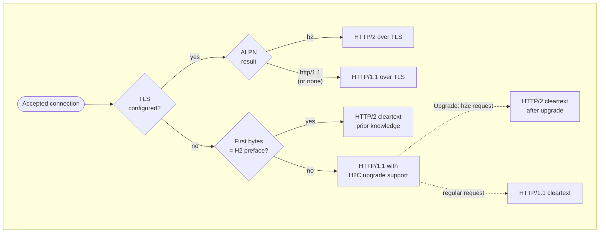
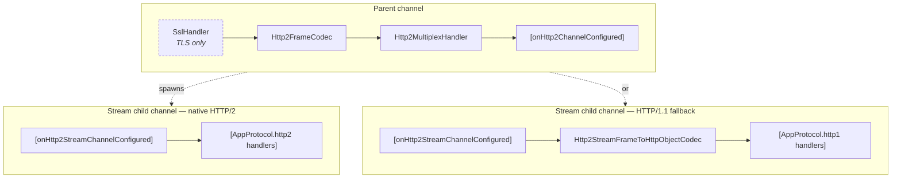
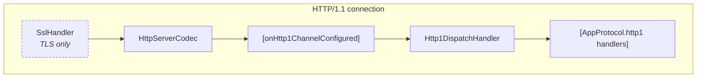

# netty-multiprotocol

[](https://central.sonatype.com/artifact/io.github.suboptimal-solutions/netty-multiprotocol)
[](https://www.apache.org/licenses/LICENSE-2.0)

Multiplex multiple application-layer protocols (dxLink, REST, custom binary)
on a single Netty server port. Handles transport negotiation (TLS+ALPN, H2C
upgrade and prior knowledge) and routes each connection or HTTP/2 stream to the
right protocol implementation by URI pattern.

## At a glance

- Single port for HTTP/1.1, H2C, and HTTP/2-over-TLS.
- URI-pattern routing (exact, path-prefix, default) following Servlet 3.1 semantics.
- Per-protocol pipeline configuration via `AppChannelConfigurer`.
- Optional `ChannelPipeline` customizers for cross-cutting handlers
  (access log, metrics, idle-state timeouts, request id) that persist across
  HTTP/1.1 keep-alive requests.
- Automatic HTTP/2 → HTTP/1.1 fallback for protocols that only implement the
  HTTP/1.1 transport.
- WebSocket layered on HTTP/1.1, with full control over the pipeline takeover.
- Netty 4.2.x at runtime (declared `provided` — bring your own version).
- No reflection, no annotations, no framework lock-in — just a `ChannelInitializer`
  you wire into your own `ServerBootstrap`.

## Usage

```java
AppProtocolRegistry registry = new AppProtocolRegistry();
registry.register("/dxlink/*", new DxLinkProtocol(...));
registry.register("/", new RestProtocol(...));

ChannelInitializer<Channel> initializer = NettyMultiprotocol.builder()
    .sslContext(sslContext)          // optional; plaintext if null
    .registry(registry)
    .onHttp1ChannelConfigured(p ->
        p.addLast("accessLog", new MyAccessLogHandler()))
    .build();

new ServerBootstrap()
    .group(boss, worker)
    .channel(NioServerSocketChannel.class)
    .childHandler(initializer)
    .bind(port).sync();
```

## Transport negotiation

Every accepted connection starts in a small negotiation pipeline. The pipeline
that ends up serving requests is selected based on TLS presence, ALPN result,
and the first inbound bytes:



These five negotiation paths converge into two final pipeline shapes — one for
HTTP/2, one for HTTP/1.1 — described in
[Per-path pipelines](#per-path-pipelines) below. After the transport is
installed, [URI routing](#uri-routing) selects which `AppProtocol` handles each
request or stream.

### Guarantees per path

| Path | Handler that selects the protocol | Where the protocol decision happens | Customizer that runs |
|---|---|---|---|
| HTTP/2 over TLS | `AlpnNegotiationHandler` (eager, on handshake) | Per HTTP/2 stream, on first `HEADERS` frame | `onHttp2ChannelConfigured` (parent), `onHttp2StreamChannelConfigured` (per stream) |
| HTTP/1.1 over TLS | `AlpnNegotiationHandler` (eager, on handshake) | Per HTTP/1.1 request | `onHttp1ChannelConfigured` (eager, once per connection) |
| H2C prior knowledge | `H2cNegotiationHandler` (peeks first bytes) | Per HTTP/2 stream | `onHttp2ChannelConfigured`, `onHttp2StreamChannelConfigured` |
| H2C upgrade | `H2cNegotiationHandler` → `HttpServerUpgradeHandler` | Per HTTP/2 stream | `onHttp2ChannelConfigured` runs **after** the `Upgrade: h2c` handshake completes |
| HTTP/1.1 cleartext | `H2cNegotiationHandler` → first request | Per HTTP/1.1 request | `onHttp1ChannelConfigured` runs on the **first non-upgrade request** |

The third column matters because the same `AppProtocolRegistry` can be matched
many times on a single connection: every keep-alive HTTP/1.1 request and every
HTTP/2 stream is routed independently.

## Pipeline configuration

The library never embeds your application logic. Instead, it gives you three
places to attach handlers, each with a different scope and a different view of
the bytes:

| Customizer | Scope | Lifetime | Sees |
|---|---|---|---|
| `onHttp1ChannelConfigured` | Per HTTP/1.1 connection | Connection lifetime, across keep-alive requests | Parsed `HttpRequest` / `HttpResponse` |
| `onHttp2ChannelConfigured` | Per HTTP/2 parent channel | Connection lifetime | Raw `Http2Frame` (connection-scoped) |
| `onHttp2StreamChannelConfigured` | Per HTTP/2 stream child channel | Single stream | Raw `Http2StreamFrame` (or HTTP objects if the stream falls back to HTTP/1.1) |

All three are optional. Use them for cross-cutting concerns: access log,
request id, metrics, idle-state timeouts. The application protocol itself is
attached through `AppChannelConfigurer` returned from `AppProtocol.http1()` or
`AppProtocol.http2()`; the dispatcher invokes it after URI resolution.

### Per-path pipelines

Each diagram below shows the **final** pipeline once negotiation is complete
and the first request has been routed to its `AppProtocol`. Boxes in `[…]` come
from customizers or from the application protocol and may be empty. The five
negotiation paths converge into two final shapes — one per HTTP version —
that differ only in whether `SslHandler` is present at the head.

**HTTP/2** — final pipeline for ALPN `h2`, H2C prior knowledge, and post-`Upgrade: h2c`:



`Http2StreamDispatchHandler` is **not** in the final stream pipeline — it
removes itself after invoking the configurer. Which of the two stream shapes
applies is decided per-stream by the dispatcher (see
[HTTP/2 → HTTP/1.1 fallback](#http2--http11-fallback)).

**HTTP/1.1** — final pipeline for ALPN `http/1.1`, and for cleartext
connections whose first request did not carry `Upgrade: h2c`:



`Http1DispatchHandler` **stays** in the pipeline for the lifetime of the
connection; `[AppProtocol.http1 handlers]` are per-request and get cleaned up
after `LastHttpContent` is written — see
[HTTP/1.1 keep-alive and per-request cleanup](#http11-keep-alive-and-per-request-cleanup).

## URI routing

`AppProtocolRegistry` maps URI patterns to `AppProtocol`s using the same
semantics as the Servlet 3.1 spec (section 12.2):

- **Exact** — e.g. `/healthz`. Matches that path and nothing else.
- **Path prefix** — e.g. `/dxlink/*`. Matches `/dxlink`, `/dxlink/`, and any
  path underneath. The longest matching prefix wins.
- **Default** — exactly `/`. Fallback when nothing else matches.

`resolve(uri)` strips the query string, then tries exact match → longest
path-prefix match → default. Returns `null` if nothing matches; the dispatcher
turns this into a `404` response without closing the connection (for HTTP/1.1
keep-alive friendliness).

## HTTP/2 → HTTP/1.1 fallback

`AppProtocol` declares two transports, both optional:

```java
@Nullable AppChannelConfigurer http1();
@Nullable AppChannelConfigurer http2();
```

A protocol that only implements `http1()` can still be reached over HTTP/2.
When `Http2StreamDispatchHandler` resolves a stream, it tries in order:

1. **`protocol.http2()`** — native HTTP/2; the configurer sees raw
   `Http2StreamFrame` objects.
2. **`protocol.http1()`** — fallback; the dispatcher installs
   `Http2StreamFrameToHttpObjectCodec` ahead of the configurer so it sees
   `HttpRequest`/`HttpResponse` exactly like on an HTTP/1.1 connection.
3. **Neither** — the dispatcher responds with `505 HTTP Version Not Supported`
   and resets the stream.

Stream resolution failures return `404` (no registration) or `505` (no
compatible transport) as HTTP/2 `HEADERS` + `DATA` frames, leaving the
connection open.

### HTTP/1.1 keep-alive and per-request cleanup

`Http1DispatchHandler` lives for the entire HTTP/1.1 connection, but the
handlers a protocol adds in `AppChannelConfigurer.configure(...)` are
per-request. The dispatcher draws the line automatically:

1. On `handlerAdded` it snapshots the pipeline — every handler present at that
   moment is considered **persistent** (TLS, HTTP codec, your
   `onHttp1ChannelConfigured` handlers).
2. After the routed protocol configures the channel and writes
   `LastHttpContent`, the dispatcher walks the pipeline and removes every
   handler that is **not** in the snapshot, then clears `requestInFlight`.
3. The next request on the same TCP connection starts from the persistent
   baseline and may resolve to a different `AppProtocol`.

The practical consequences:

- Persistent customizers see every request on the connection — perfect for
  access log, metrics, request id, idle-state timeouts.
- A protocol configurer can install per-request handlers (aggregators,
  decoders, business logic) without worrying about cleanup: the snapshot
  takes care of it.
- Different protocols can share a TCP connection. A REST request followed by
  a Connect request on the same keep-alive socket works correctly because
  the per-request handlers from the first protocol are gone by the time the
  second request arrives.
- Request pipelining is **not** supported. A second `HttpRequest` arriving
  while `requestInFlight` is true closes the connection.

## WebSocket

WebSocket is not a separate transport in this library — it is layered on
HTTP/1.1, exactly as in the WebSocket RFC. A protocol that wants to accept
WebSocket connections returns its configurer from `http1()` and, inside that
configurer, takes exclusive ownership of the channel:

```java
public final class WebSocketProtocol implements AppProtocol {
    @Override
    public AppChannelConfigurer http1() {
        return channel -> {
            ChannelPipeline p = channel.pipeline();

            // After the WS handshake the channel is no longer HTTP/1.1.
            // Http1DispatchHandler would try to route subsequent WebSocket
            // frames as HTTP requests and break the connection — remove it.
            p.remove(HttpPipelineConfigurer.DISPATCH_HANDLER);

            // Netty's WebSocketServerProtocolHandler performs the handshake
            // on the first matching HttpRequest and then switches the codec
            // to WebSocket frames.
            p.addLast(new HttpObjectAggregator(64 * 1024));
            p.addLast(new WebSocketServerProtocolHandler("/ws"));
            p.addLast(new MyWebSocketFrameHandler());
        };
    }
}
```

A few subtleties:

- The constant `HttpPipelineConfigurer.DISPATCH_HANDLER` is the registered
  name of `Http1DispatchHandler` in the pipeline; using the constant avoids
  hard-coding `"dispatch"`.
- Handlers from `onHttp1ChannelConfigured` stay in the pipeline (they were
  part of the persistent snapshot taken before the dispatcher was added). They
  will see WebSocket frames after the handshake, not HTTP objects — design
  your access log / metrics handlers accordingly, or have them act on the
  initial handshake request and detach themselves.
- Because the configurer removes the dispatcher, no per-request cleanup ever
  runs for this channel. That is correct: the channel now belongs to the
  WebSocket protocol for the rest of its lifetime.

## Dependencies

Netty is declared with Maven scope `provided`. The library is built against
the version pinned in `pom.xml`, but at runtime it is binary-compatible with
any Netty 4.2.x release — pull in whichever you prefer:

```xml
<dependency>
    <groupId>io.github.suboptimal-solutions</groupId>
    <artifactId>netty-multiprotocol</artifactId>
    <version>...</version>
</dependency>
<dependency>
    <groupId>io.netty</groupId>
    <artifactId>netty-codec-http2</artifactId>
    <version>4.2.x</version>
</dependency>
<!-- netty-codec-http and netty-handler are pulled in transitively -->
```

The 4.2 baseline is intentional: it lines up with the incubator HTTP/3 codec,
which is where future work in this library is heading.

## Roadmap: HTTP/3

`AppProtocol` already exposes an `http3()` method, but it is reserved — the
library does not yet wire QUIC transport or H3 negotiation. The method is in
place so that protocol authors can declare HTTP/3 support today and pick it
up automatically once the transport lands.

## Development

Standard Maven project — run `./mvnw verify` to build and test.

## License

Apache 2.0
